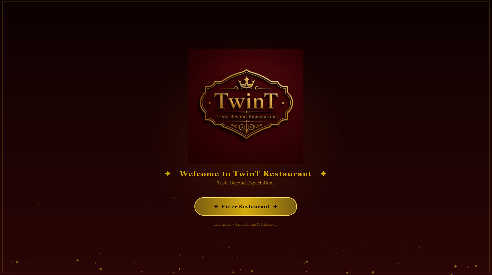
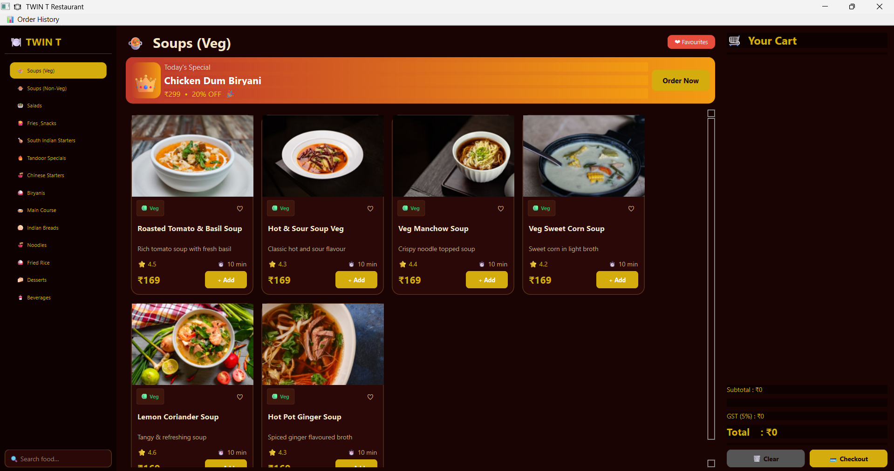
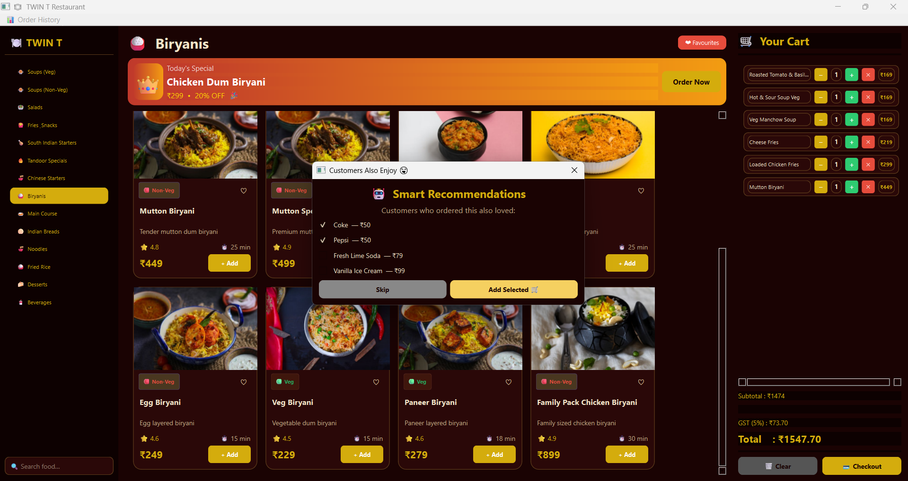
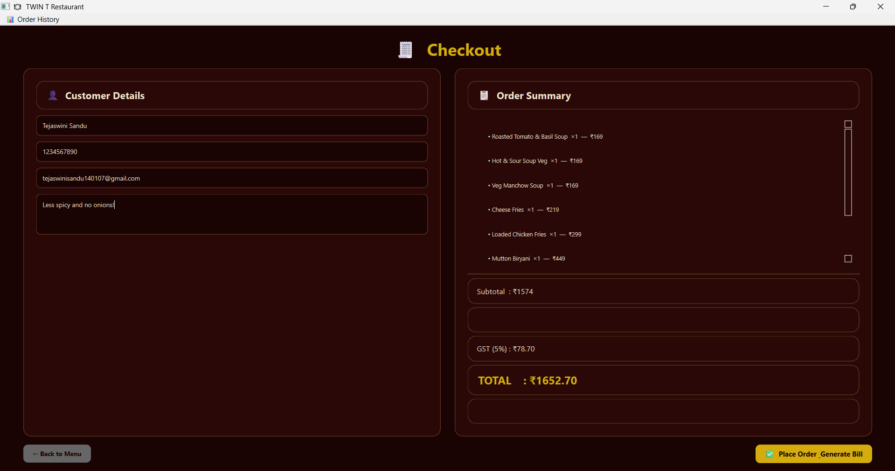
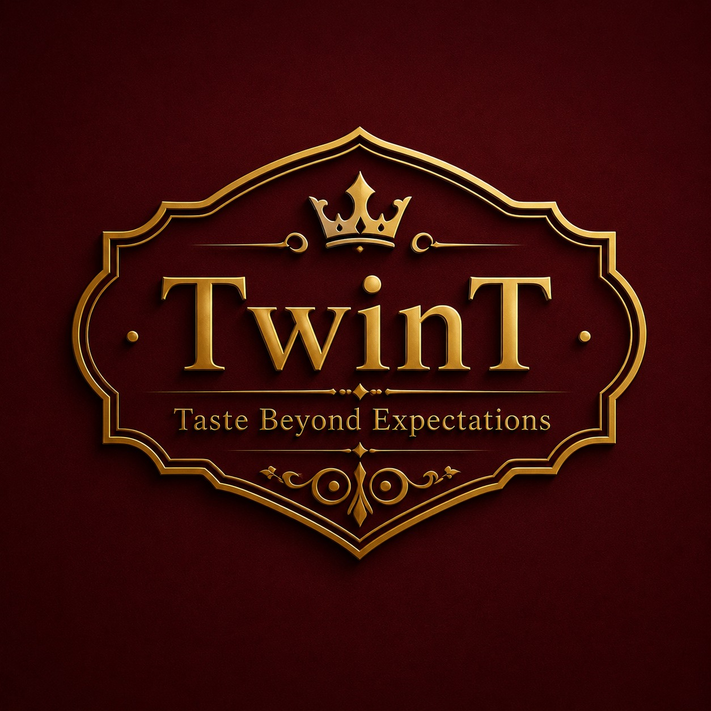

#  TWIN T Restaurant – Self-Ordering System

## Setup & Run

### 1. Install dependencies
```bash
pip install PySide6 reportlab Pillow
```

### 2. Run the application
```bash
python main.py
```

---

## Project Structure
```
TwinT/
├── bills/
├── data/
│   ├── image_cache/
│   ├── file_handler.py
│   ├── image_loader.py
│   ├── menu_data.py
│   ├── pdf_generator.py
│   ├── customers.txt
│   ├── favorites.txt
│   ├── feedback.txt
│   └── orders.txt
├── logo.png
├── main.py
├── README.md
|──screenshots/
│   ├── home.png
│   ├── menu.png
│   ├── cart.png
│   ├── checkout.png
│   ├── feedback.png
│   └── bill_pdf.png
├── requirements.txt
└── test_images.py

```

---

## Features Implemented

| Feature | Status |
|---|---|
|  Splash Screen with progress bar | ✅ |
|  Full Menu – 100+ items, 14 categories | ✅ |
|  Live Search | ✅ |
|  Today's Special banner | ✅ |
|  Shopping Cart (add/remove/qty) | ✅ |
|  Smart Recommendations dialog | ✅ |
|  Favourite Items | ✅ |
|  Customer Details + Validation | ✅ |
|  Offers & Discounts (10% / Free drink / Dessert) | ✅ |
|  Billing (Subtotal + Discount + GST) | ✅ |
|  PDF Invoice (ReportLab) | ✅ |
|  File Handling (customers.txt / orders.txt) | ✅ |
|  Order History with search | ✅ |
|  Customer Feedback (star rating + comment) | ✅ |

---

## Notes
- PDF generation requires `reportlab`. If not installed, a plain `.txt` bill is saved instead.
- All data files are auto-created in `data/` on first use.
- Bills are saved in `bills/` as `Invoice_TWT001.pdf`, etc.# TwinT Restaurant — Self-Ordering System

A desktop restaurant ordering application built using **Python** and **PySide6** that enables customers to browse menus, view dish images, manage carts, place orders, track order history, and submit feedback through an interactive graphical interface.

## Key Highlights

* Built using Python and PySide6 (Qt6)
* Interactive desktop GUI for restaurant self-ordering
* Food image integration using the Pexels API
* Smart cart and billing system with GST calculation
* Order history and favorites management
* Customer feedback and rating system
* Modular project architecture for maintainability

---

##  Features

*  Extensive Menu with Food Images
*  Real-Time Cart Management
*  Favorites System
*  Smart Dish Recommendations
*  Order History Tracking
*  Customer Feedback & Ratings
*  Live Menu Search
*  GST-Enabled Billing
*  Today's Special Section
*  Dynamic Food Image Loading

---

## Tech Stack

| Technology    | Purpose                   |
| ------------- | ------------------------- |
| Python 3.11+  | Core Programming Language |
| PySide6 (Qt6) | Desktop GUI Framework     |
| Pexels API    | Food Image Integration    |
|Text Files     | Data Storage              |
| Git & GitHub  | Version Control           |

---

## Installation

### Clone the Repository

```bash
git clone https://github.com/tejaswinisandu/-TwinT-Restaurant-Ordering-System.git
cd -TwinT-Restaurant-Ordering-System
```

### Install Dependencies

```bash
pip install -r requirements.txt
```

### Run the Application

```bash
python main.py
```

### Load Food Images

```bash
python data/image_loader.py
```

---

## Screenshots

### Home Screen


### Menu


### Cart


### Checkout


---

## Future Enhancements

* Online Payment Integration
* Customer Authentication System
* Admin Dashboard
* Database Integration
* Advanced Recommendation Engine
* Analytics and Reporting

---

## License

This project is intended for educational, learning, and portfolio purposes.

---

<p align="center">
  Developed by <b>Tejaswini Sandu</b> and <b>Tarun Gunda</b>
</p>

<p align="center">
  
</p>

